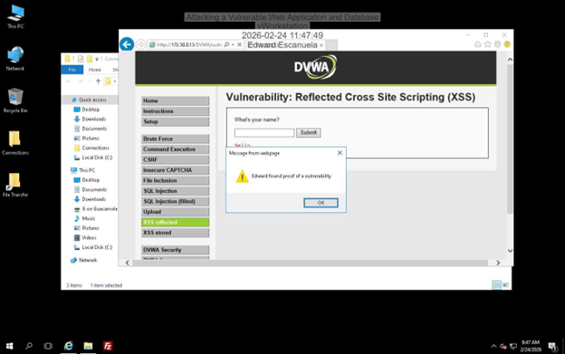
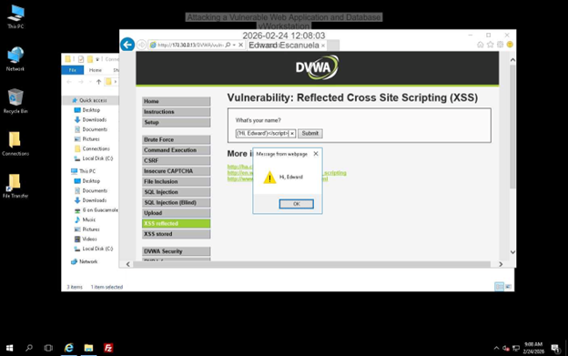
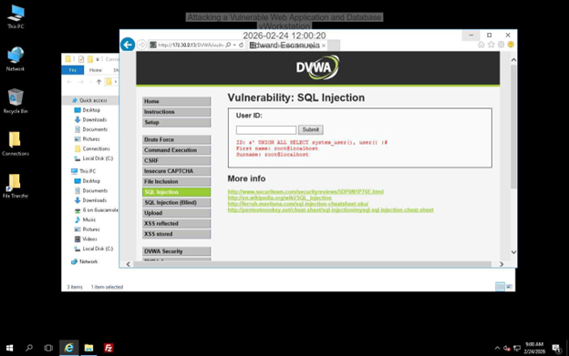
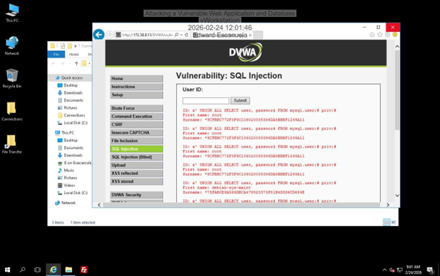
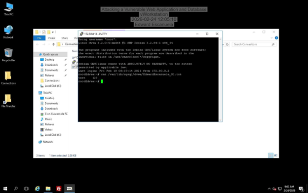
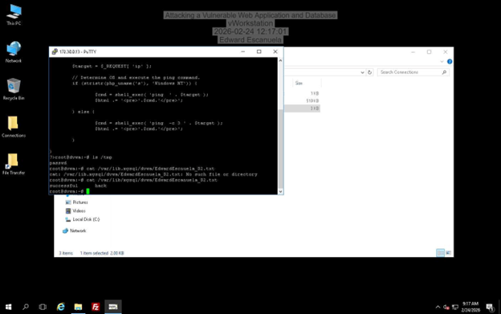

# DVWA Web Application Exploitation Lab

**Role:** SOC Analyst (Training Environment)

---

## Overview

This project demonstrates exploitation of a vulnerable web application using multiple attack techniques including Cross-Site Scripting (XSS), SQL Injection, and server-side manipulation.

The lab simulates real-world vulnerabilities caused by improper input validation and excessive database privileges.

---

## Objective

* Identify web application vulnerabilities
* Execute client-side and server-side attacks
* Extract sensitive database information
* Demonstrate impact of insecure configurations

---

## Environment

* Target: DVWA (Damn Vulnerable Web Application)
* OS: Debian Linux
* Database: MySQL

### Tools Used

* Web Browser
* PuTTY

---

## Exploitation Process

### 1. Reflected Cross-Site Scripting (XSS)

Injected JavaScript payloads into input fields.

Result:

* Scripts executed successfully in the browser
* Confirmed lack of input sanitization

Impact:

* Session hijacking
* Credential theft
* Malicious redirects

---

### 2. SQL Injection

Used UNION-based SQL injection to retrieve database information.

Result:

* Extracted database user: `root@localhost`
* Retrieved usernames and password hashes

Impact:

* Full database access
* Exposure of sensitive credentials

---

### 3. Credential Extraction

Accessed MySQL system tables to retrieve hashed passwords.

Impact:

* Enables offline password cracking
* Compromises authentication security

---

### 4. File Creation via SQL Injection

Used INTO OUTFILE to write files directly to the server.

Result:

* Created files:

  * EdwardEscanuela_S1.txt
  * EdwardEscanuela_S2.txt

Impact:

* Ability to modify server filesystem
* Potential for persistence or backdoor placement

---

### 5. Command Injection

Executed system-level commands through unsanitized input.

Impact:

* Direct interaction with the operating system
* Full system compromise potential

---

## Evidence

### Reflected XSS Execution

JavaScript payload executed successfully, confirming reflected XSS vulnerability.

---

### XSS Payload Variation

Second payload confirms the vulnerability is consistent and repeatable.

---

### SQL Injection - Database Access

Injection reveals database user running as root, indicating critical misconfiguration.

---

### SQL Injection - Credential Extraction

Usernames and hashed passwords extracted from the database.

---

### File Creation via SQL Injection

File successfully written to the server using SQL injection.

---

### Repeated File Creation

Second file confirms the ability to modify the server filesystem reliably.

---

## Key Takeaways

* Lack of input validation enables multiple attack vectors
* Using root database accounts significantly increases risk
* SQL injection can escalate to full system compromise
* Web vulnerabilities impact both client and server layers

---

## Real-World Relevance

These vulnerabilities are commonly exploited in real-world attacks targeting insecure web applications.

Security professionals must:

* Validate all user input
* Use parameterized queries
* Limit database privileges
* Implement secure coding practices

---

## Mitigation

* Use prepared statements to prevent SQL injection
* Sanitize and encode all user input
* Apply least privilege principles
* Remove unnecessary database permissions
* Use strong password hashing methods
